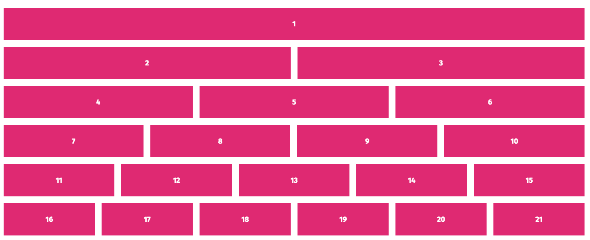
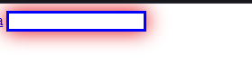
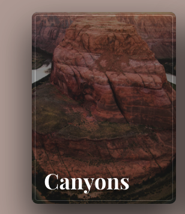
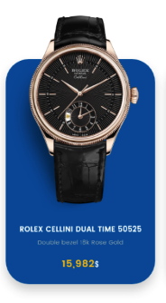

# desafios-front

1 - Desenvolver um grid simples com flex-box. Ex:

2 - Formatar o mesmo texto "Desenvolvimento front end" para que fique nos seguintes formatos: 
   https://codepen.io/diegoslva/pen/mdOjMKq
  - TUDO MAISCULO
  - Letras Iniciais MAISCULA
  - Letras tudo minisculo

3 - Desafio de especificidade 
  https://codepen.io/diegoslva/pen/JjbBJyx

4 - Herença css, fazer color link herdar "color" definido no body
  https://codepen.io/diegoslva/pen/YzpjQLP

5 - Faça o dropdown com o hover do mouse
    https://codepen.io/diegoslva/pen/dyOjzZO

6 - Estilizar input após focus do mouse
  

    
  

7 - Crie um card com seguindo o mesmo estilo

8 - Crie esse efeito com css (pode ser qualquer outra imagem no lugar do relogio)
  

9 - Crie um slide com 3 imagens e quando clicar abrir um modal

10 - Criar um Modal utilizando js

11 - Crie o mesmo Modal apenas com CSS (opcional, porém, caso o faça irá ganhar bastante experiencia com css)

LIVRO HTML CSS 
https://drive.google.com/file/d/0B0tXPiaMdGsfMkJfRGcwM0xJVnc/view?usp=sharing

refs 
https://app.rocketseat.com.br/discover

CSS 
https://developer.mozilla.org/pt-BR/search?q=flex+box

https://tableless.com.br/categories/css/
https://developer.mozilla.org/pt-BR/docs/Learn/Getting_started_with_the_web/CSS_basics
https://developer.mozilla.org/pt-BR/docs/Web/CSS/position
https://developer.mozilla.org/en-US/docs/Web/CSS/Containing_block
https://developer.mozilla.org/pt-BR/docs/Web/CSS/Specificity

HTML 
https://tableless.com.br/categories/html/
https://developer.mozilla.org/pt-BR/docs/Learn/Getting_started_with_the_web/HTML_basics
https://app.rocketseat.com.br/node/o-guia-estelar-de-html/group/conceitos-7/lesson/atributos

POR FIM 

Use todo esse conhecimento aprendido e construtora a landingPage

